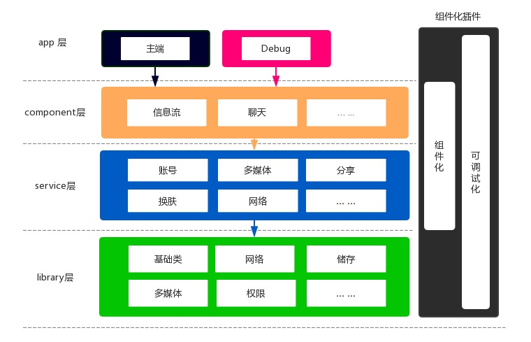
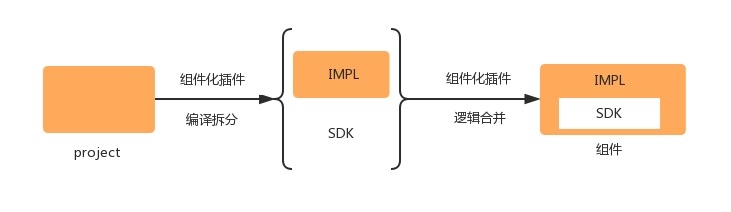
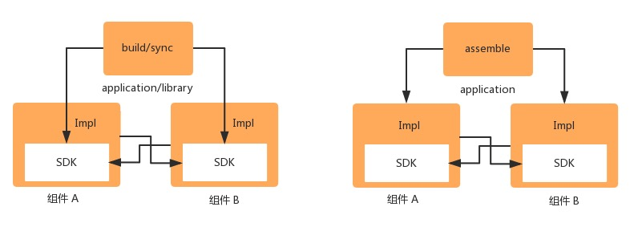

README: [English](https://github.com/YummyLau/ComponentPlugin/blob/master/README.md) | [中文](https://github.com/YummyLau/ComponentPlugin/blob/master/README-zh.md)

### 插件初衷

> 随着android 9.0及新版本的问世，系统越来稳定封闭，插件化的道路也越发艰难，开发逐步偏向模块化开发。之所以回归组件化是因为任何模块功能稳定拆分或组合成组件，在 android 工程中组件的概念并不明显。尝试过尝试过业界很多方案，各有千秋，但并没有一个支持代码隔离，支持独立调试，且不对任何现有代码进行改动的插件。

从一开始了解到 《微信的模块化架构重构实践》 开始关注组件化，到接触得到/美团外卖/51信用卡/猫眼等方案，从中获益良多。我理解的组件化同，工程上要满足 “不同功能粒度的模块独立”，业务要满足 “功能独立”，开发上更要满足 “依赖隔离，面向接口编程”。这便是为何我方案放弃使用路由方案来转发 api 的原因。该轮子更偏向于解决 “便捷调试/完全代码隔离” ，同样便捷支持模块 api 的绑定解绑。

### 版本更新
* 2019/10/10 1.0.3-beta 
	* 支持组件循环依赖
	* 支持并发 transform 加快编译速度
* 2019/10/22 1.0.4 
	* 调整gradle插件版本为3.1
	* 优化调试 log 格式
	* 解决多task任务下 make project 编译失败的问题
* 2019/11/04 1.0.5 
    * 支持模块内子工程pin
    * 提供更人性化的调试日志格式
* 2019/12/09
    * 优化插件 gradle 增量编译
* 2020/05/28
    * 调整sdk注入逻辑，优化 sdk 注册，避免极端情况下多模块重复注册导致已绑定的实现丢失
* 2022/11/16
    * 支持sdk之间的单向依赖，详细见demo
    * 优化组件的编译缓存，优化编译速度
    * 支持sdk和impl发布至maven
    * 支持组件自动化切换maven依赖，本地文件依赖和源码编译(依赖git提供基础能力)
    * 支持组件自动化版本管理(依赖git提供基础能力）
    * 支持编译注入impl时从maven产物，本地编译缓存和源码编译三者中自动注入
    - 暂时取消组件debug能力
    - 暂时取消pin工程支持能力

### 为什么要使用

**tip：** *下文 module 一词均表示 android Studio 创建的原生模块，组件 一词均表示经过插件处理后的 module 模块*

#### 对比其他插件的优势

* **完全代码隔离（划重点）**

	采用 “面向接口” 编程，废除硬编码编程暴露api（比如路由），在build/sync流程依赖 SDK，在assemable流程注入 IMPL。
* **支持循环依赖（划重点）**

	这很重要！对于 module，由于无法循环依赖导致各自暴露的内容需要下沉到下一个模块，而组件通过分离 SDK/IMPL 解决这个问题。
* **便捷集成调试**

	基于 module 依赖进行调试，不修改动态修改库的原生插件。（比如调试模块依赖 组件A 来进行组件 A 功能测试），支持多目录调试多组件/android库/自定义配置等。
* **接入成本极低**

	在根 project 申明插件并添加配置脚本，插件会根据配置自动注入到各子 Project 并完成 sdk 打包。

#### 对 Android 工程结构的建议



* **library层** 

	基础类库,存放精简的代码，高复用性，一般其他模块直接引用即可，比如Utils，BaseActivity 等
* **service层** 

	支持某类基础业务功能的独立模块，比如登陆服务，换肤服务，介于 library 层和 component 层中间，也可以直接被 app 层调用
	
* **component层** 

	聚合多中基础业务功能的复杂业务模块，比如朋友圈，附近的人，一般可能使用多个 service 服务，也可以直接使用 library
	
* **app层**
 	应用入口，聚合多个业务模块，比如主端或者调试程序

良好的架构需要满足高可用易调试，**插件支持任意层的功能调试，同时把 service/component 层的 Module 转成组件来打破传统组件化的限制。** 

插件通过干预 module 的构建流程，把源码划分为 SDK 和 IMPL，其中 SDK 编译成 jar，IMPL 为除了 SDK 以外的 所有资源.



因此， module 或 组件的依赖关系转化为


实际上，依赖的场景会根据不同的构建流程而动态改变



### 如何使用

* 添加插件依赖并声明依赖仓库

```
buildscript {
    repositories {
        maven { url 'https://jitpack.io' }
    }
    dependencies {
        classpath "com.github.DSAppTeam:ComponentCornerstone:1.0.12
    }
}
allprojects {
    repositories {
        maven { url 'https://jitpack.io' }
    }
}

```
* 编写插件脚本（可参考 sample gradleScript目录中 component.gradle）并在根 project 使用

```
apply from: "./gradleScript/component.gradle"
```

* 在需要组件化的 module 中新增 sdk 目录存放暴露的源码 (可参考 sample library/src/sdk)，会自动编译成 jar

```
+ library/src/sdk/<packagePath>/xxx.java or xxx.kt
```


### Sample or AndroidModularArchiteture 项目的实践

 

* 绿色为独立运行的 module
* 蓝色为独立运行的 service（组件）
* 橙色为独立运行的 component (组件)
* 黑色为主端，默认调试为不配置调试组件的运行结果，自定义调试为支持调试任何模块的运行结果（上述绿/蓝/橙可视为自定义调试，只是调试的功能针对对应的module/组件而已）

**链接：**[AndroidModularArchiteture](https://github.com/YummyLau/AndroidModularArchiteture) 


### 参考/特别鸣谢
早在 17 年微信发布过 [微信Android模块化架构重构实践](https://mp.weixin.qq.com/s?__biz=MzAwNDY1ODY2OQ==&mid=2649286672&idx=1&sn=4d9db00c496fcafd1d3e01d69af083f9&chksm=8334cc92b4434584e8bdb117274f41145fb49ba467ec0cd9ba5e3551a8abf92f1996bd6b147a&mpshare=1&scene=1&srcid=06309KcVegxww8kRannKXmkM&key=9965dca0b72a0a7428febd95a3bc61657924797129ae35d34f67f2cfc5c5ac09bec624714cd4662b978742d3424726f08b3ea1b9cb858cccf97dbb56bd5bfdd07a81917eedc452194d3c6b438d76dfac&ascene=0&uin=Mjg5NTY2MjM0MA==&devicetype=iMac%20MacBookPro11,4%20OSX%20OSX%2010.12.5%20build(16F73)&version=12020810&nettype=WIFI&fontScale=100&pass_ticket=X8yiKyEXbEsX7ouYBsjW0ddHl5Zc0CXaGzDaapnZidysc89C7Z257hmzlRaR3CQk) 一文中涉及到通过接口保护形式（.api化）拉实现分离模块的功能并生成对应的 'SDK' 工程，其他工程依赖编译的只是这个生成的工程。
曾把模块提供的接口独立为一个工程并打包成sdk，但这样就会导致 sdk 和 impl 分为两个模块，不好维护和不雅观。业界优秀开源项目 Mis 提供了一种代码隔离的思路，大致为：

* 通过修改 sourceSet 把接口文件放到 aidl 文件中，并接口打包成 sdk
* 实现工程依赖打包的 sdk

通过研究源码参考作者编写的思路，确实是一种好用的方法，细节逻辑见源码。值得一提的是，sdk 是一个 jar，不仅仅可以包含业务 api，也可以包含数据接口 bean等。在插件开发的过程中，感谢 Mis 作者 [EastWoodYang](https://github.com/EastWoodYang) 给予了我很多帮助和指导！